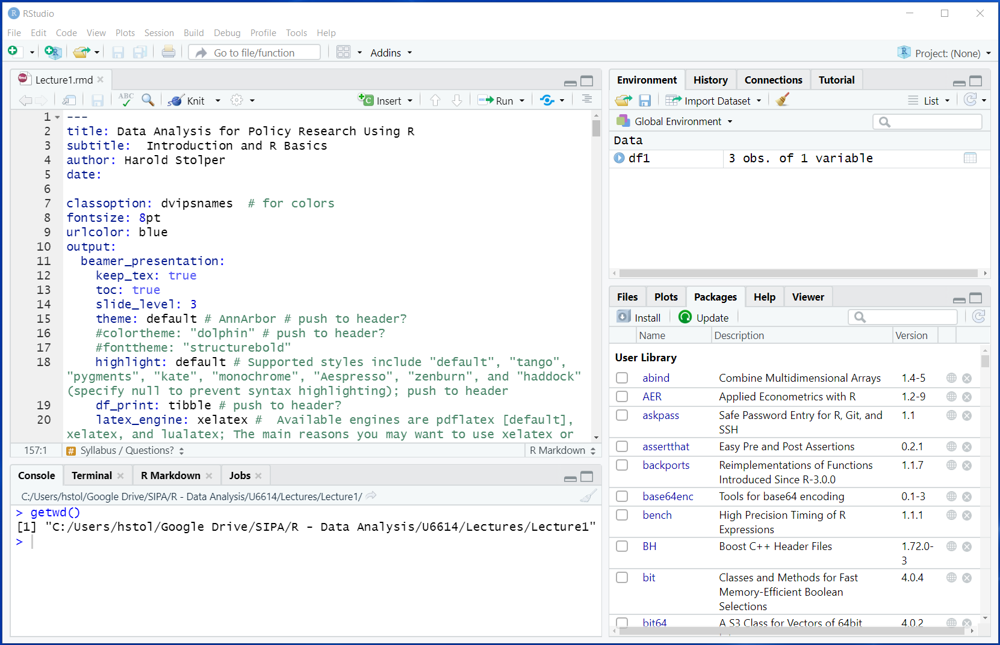

```{r, echo=FALSE}
knitr::opts_chunk$set(collapse = TRUE, comment = "#>", highlight = TRUE)
```


# Introductions 


### Harold Stolper, instructor (he/they)

Graduated from SIPA many moons ago, returned to Columbia for my PhD in economics.

\medskip

Past 6 years: 

* Taught quant courses at SIPA.
* Worked as the economist for a non-profit doing research and advocacy to promote upward mobility for low-income NYers.
* Recent focus on documenting racist police enforcement of fare evasion, and other topics related to policing, neighborhood change, and transit accessibility.

 
\medskip

Transitioning from Stata to R after years of using and teaching Stata.


### Niyati Malhotra, Teaching Assistant (she/hers)

Took this class last semester, graduating this May.

\medskip

* Previously worked on impact evaluations of public health and education programs.
* Interested in social policy applications that address early childhood development and child poverty.


# What is R and How Will We Use It?


### What is R?

- R is "an alternative to traditional statistical packages such as SPSS, SAS, and Stata such that it is an extensible, open-source language and computing environment for Windows, Macintosh, UNIX, and Linux platforms." [(ICPSR)](https://www.icpsr.umich.edu/icpsrweb/content/shared/ICPSR/faqs/what-is-r.html)

\medskip

- "R is an integrated suite of software facilities for data manipulation, calculation and graphical display." ([R-project.org](https://www.r-project.org/about.html))


### How will we use R?

- [RStudio](https://www.rstudio.com/products/rstudio/download/preview) is a powerful user interface for R. 
  - After you install R and RStudio, we'll be working entirely in the RStudio interface.

\medskip

- [R Markdown](https://rmarkdown.rstudio.com/lesson-1.html) files are used in RStudio to "both save and execute code, and generate high quality reports that can be shared with an audience."
  - These pdf lecture slides were created with R Markdown.
  - Subsequent weeks we'll rely on html-based lessons created with R Markdown.
  - After Assignment 1, everything **you** submit for this class will be a document generated with R Markdown.


### Base R vs. user-defined R packages

R uses "packages" as bundles of code, data and documentation.

The default R [base](https://stat.ethz.ch/R-manual/R-devel/library/base/html/00Index.html) package includes much of the basic functionality you will be using.  

Then there are [R packages](http://r-pkgs.had.co.nz/intro.html) developed and shared by others. Some R packages we'll be using include:  

- `tidyverse`  
- `ggplot2` 

More about these in later weeks...


### Installing and loading R packages

You only need to install a package once. To install an R package use `install.package()` function.
```{r eval = FALSE, warning = FALSE, message = FALSE}
install.packages("tidyverse")
```

But before you can use it you need to load a package every time you open R using the `library()` function. 
```{r}
library(tidyverse)
```


###  What can you do with R + RStudio + RMarkdown?

Things you can also do using Stata:

- Data cleaning and manipulation
- Statistical analysis and plots

\medskip

Things you can't do in Stata:

- Generate reports and presentations
- Generate interactive content
  - Maps
  - Graphs
  - Dashboards


### What will we be doing in this class?

We'll be learning how to use R to explore data to inform policy. 

That means we'll be spending a lot of time working through R, but also thinking about how/when to use the methods and concepts we've learned in Quant I and II:

- **Research design:** understanding how data structure impacts analysis and causal inference

- **Data management:** cleaning and structuring data for analysis

- **Exploratory analysis:** identifying and analyzing key factors in your analysis

- **Explanatory analysis:** estimating relationships between variables to inform
policy

- **Data visualization and presentation:** conveying findings to your target audience

- **Policy writing and interpretation:** translating statistical analysis in accessible terms


### Sample visualizations from student projects (Niyati & Crystal Avila)

{width=90%}


### Sample visualizations from student projects (Liz Olson & Jenny Ostrowski)

{width=90%}


# Course Logistics


### Syllabus and file management

Course materials:

* All course files will be posted on the course website: https://hreplots.github.io/U6614/ 

\medskip

We'll be using Courseworks + Piazza for several purposes:

* hosting Zoom links for classes and recitation
* weekly quizzes on asynchronous lessons
* submitting assignments and project deliverables
* course communications and discussion using Piazza (register [here](https://piazza.com/demo_login?nid=keiqq7y84rt5y2&auth=6c81e06))

\medskip


### Synchronous and asynchronous instruction

1. Review asynchronous lessons in advance of class

    + will be posted to the course website by Thursday night
    + class meetings will begin with a very short multiple choice quiz on the asynchronous material

\medskip

2. Synchronous instruction

    + short Zoom quiz 
    + discussion of data applications including assignments
    + workshop-style instruction with R
        - prepare for class by downloading the week's R script & data from the course website
        - maintain a logical file structure to organize files (e.g. Lectures/Lecture1)
    + we'll set *community guidelines* for in-class participation/R support next week

\medskip

**Questions?**


# RStudio

### What is RStudio?

"[RStudio](https://rstudio.com/products/rstudio/) is an integrated development environment (IDE) for R. It includes a console, syntax-highlighting editor that supports direct code execution, as well as tools for plotting, history, debugging and workspace management."

{width=90%}


# R Projects and Directory Structure


### Working directory

R looks for files in your **working directory**

The function `getwd()` shows the current working directory (also shown at the top of the RStudio console).
```{r}
getwd()
```
Function `list.files()` lists all files located in working directory
```{r, results="hide"}
list.files()
```

*Note that functions can accept arguments inside of parentheses, but the simple functions shown above do not require any arguments.*


### So what is the working directory?

When you run code from the **R Console** or an **R Script**, or from __code chunks__ in an R Markdown file (.rmd), the working directory is...

- the folder your file is saved in, or ...
- if you are working within an **R Project**, the working directory is the main directory for the project (more on that shortly!)


```{r}
getwd()
```

- For this class we'll generally be using R projects to keep organized.


### The path is how we refer to a directory 

**Absolute file path**:  a complete list of directories needed to locate a file or folder. 

\smallskip
`setwd("C:/Users/Harold Stolper/Google Drive/SIPA/R - Data Analysis/Fall 2020/Lectures/Lecture 1")`

\medskip

**Relative file path**: a way of indicating a given file location relative to your working directory (note that they might be the same!)

- Assuming your current working directory is in the "lecture2" folder and you want to go up 2 levels to the "Fall 2020" folder, your relative file path would look something like this:  

`setwd("../../")`  

\medskip

**File path shortcuts:**

| **Key** | **Description** |
| ------ | -------- |
| ~    | tilde is a shortcut for the user's home directory   |
| ../    | moves up a level   |
| ../../    | moves up two level   |


### What is an R project? Why are we using them?

What is an "R project"?

* A file that keeps all "project" files organized together:
  +  input data, R scripts, analytical results, and figures.
* When you open an R project, your working directory is automatically set to the directory where your R project lives.

Why will we be asking you to create and work with R projects? 

* We want you to be able to run the R Markdown files (.rmd) used to generate each lecture.
* Sometimes these .rmd files point to certain sub-folders
* You can create or download an R project with directory structure (i.e. organizing files and sub-folders in a particular way).
* That way you'll be able to run .rmd files from your own computer that point to files in sub-folders without making any changes to file-paths.


# R Basics


### Executing code in R

Three ways to execute commands in R

1. **Console:** type/paste commands to run "on the fly"
2. **R scripts** (.r files)
    - Just a text file full of R commands
    - Can execute one command at a time, several commands at a time, or the entire script
3. **Code chunks** in R Markdown (.rmd files)
    - Can execute one command at a time, one chunk at a time, or "knit" the entire file into a document (html or pdf) that includes output from R code chunks


### Shortcuts for executing commands

1. Code chunks in R Markdown files
    - **Cmd/Ctrl + Enter**: execute highlighted line(s) within chunk
    - **Cmd/Ctrl + Shift + k**: "knit" entire document

    \medskip

2. R scripts (.r files)
    - **Cmd/Ctrl + Enter**: execute highlighted line(s)
    - **Cmd/Ctrl + Shift + Enter** (without highlighting any lines): run entire script
    
    
### Assignment in R

__Assignment__ means assigning a value/set of values to an "object"

- `<-` is the assignment operator
    - in other languages `=` is the assignment operator
- code is dense and hard to read, so it's good practice to put a space before and after assignment operator

```{r}
# Create an object a and assign value
a <- 5
a

# Create an object b and assign value
b <- "yay!"
b
```

*Note 1: comments start with one or more `#` symbols*

*Note 2: R is caps sensitive!*


### Objects and assignment

R stores information in objects (like all "object-oriented" programming languages).

Some objects:

- numbers
- character strings
- vectors 
- matrices
- lists
- functions
- plots
- data frames (the datasets of R!)

Throughout this course, we'll be loading data objects to work with and assigning values to new objects.


### Functions

Functions do things to different objects. They often accept arguments -- we say we "pass" arguments to functions.

Functions are also objects themselves that can be "called" to do things like:

- calculate and display statistics
- generate output 
- display part or all of objects (e.g. show some data)
- manipulate objects (e.g. create a new column of data)
- extract information from objects (e.g. the number of rows of data)

Base R includes lots of functions. We'll be working with base R functions and handy functions from additional packages. 


### Let's jump in!

Our goals for today's R workshop example are very modest:

- Create an R project including R script.
- Look around and get our bearings.
- Install and load a package ([gapminder](https://www.gapminder.org/)).
- Use base R functions to inspect a data frame included with this package.
- Use some functions to perform some very basic analysis.
- Assign results from our analysis to new objects and display them.


# Assignment 1

### Assignment 1: submit an R script via CW before midnight next Monday

See **Assignment1.r** for details. 

\medskip

Complete the assignment by including the necessary code, organized by (sub)question, and use comments for non-code responses. 

\medskip

Submit only your R script through CW using the following file name syntax: **"Assignment1-YOURUNI.r"** via CW

* e.g. "Assignment1-hbs2103.r" 


### General assignment guidance

- **Use blank spaces liberally**, code is hard to read and spaces help!
- **Use comments liberally** throughout your R script to describe your steps.
- **Try to keep your code within the margins** to make it more readable.
    - R should know it can keep reading on the next line before executing... unless you break after executable code
- Troubleshooting is a critical skill! Here are some tips and resources:
   - Consult the R script from today's class for examples.
   - Get used to using R's built in documentation by using "?"
   - Use Google liberally to identify functions and find examples that work.
   - When you're stuck, focus on finding examples to get your own code to work, even if you don't feel comfortable with all the syntax just yet.
- Consulting with others is fine! Copying, however, is not the way to learn to code or any language.
   - **Copied assignment submissions will result in a 0 for all parties.**
   
   

# Course expectations

### Course expectations

1. Review asynchronous (pre-class) lessons **before class**

2. Live attendance of class sessions is **required**

    + CW quizzes, in-class discussion and R workshop participation

3. 5 weekly assignments ("data memos")

4. Data projects (starting week 5)

    + will culminate with a presentation and report at end of semester
    + see syllabus for dates of intermediate deliverables
    + 3 required meetings with the teaching team to discuss progress
    
5. Piazza discussion board participation

6. Recitation and office hours

\medskip

**Questions?**
   


