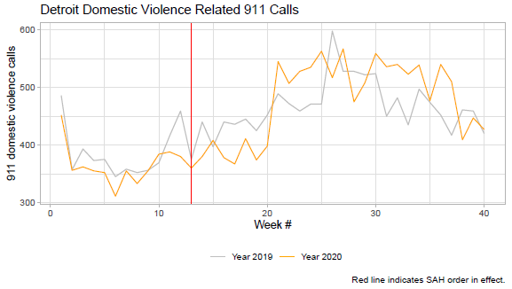

```{r, echo=FALSE}
knitr::opts_chunk$set(collapse = TRUE, comment = "#>", highlight = TRUE)
```


# Introductions 


### Student introductions

1. Preferred name
1. Pronouns (if comfortable)
1. Previous R exposure/experience
1. And answer one of these two questions:
    - What's something you would eventually like to learn how to do in R?
    - What's something that you have observed or think is important that people in your field aren't paying attention to?
1. (optional) One piece of culture you are excited about right now
    - e.g. music, writing, fashion, a meme, other art, sports, etc.

### Teaching Assistants

- Liam Tay Kearney (morning section)
- Sasha Foster-Andres (afternoon section)


### Harold Stolper, instructor

Graduated from SIPA many moons ago, returned to Columbia for my PhD in economics.

\medskip

Recent background: 

- This is my 7th year teaching quant courses at SIPA.
- Worked as the economist for a non-profit doing research and advocacy to promote upward mobility for low-income NYers.
 - Recent focus on documenting racist police enforcement of fare evasion, and other topics related to policing, neighborhood change, and transit accessibility.

 
\medskip

Transitioned from Stata to R after years of using and teaching Stata.


# What is R and How Will We Use It?


### What is R?

- R is "an alternative to traditional statistical packages such as SPSS, SAS, and Stata such that it is an extensible, open-source language and computing environment for Windows, Macintosh, UNIX, and Linux platforms." [(ICPSR)](https://www.icpsr.umich.edu/icpsrweb/content/shared/ICPSR/faqs/what-is-r.html)

\medskip

- "R is an integrated suite of software facilities for data manipulation, calculation and graphical display." ([R-project.org](https://www.r-project.org/about.html))


### How will we use R?

- [RStudio](https://www.rstudio.com/products/rstudio/download/preview) is a powerful user interface for R. 
  - After installing R and RStudio, we'll be working entirely in the RStudio interface.
  - We'll be working with R scripts every week! (an R script is more or less a text file that RStudio recognizes as R code)

\medskip

- [R Markdown](https://rmarkdown.rstudio.com/lesson-1.html) files are used in RStudio to "both save and execute code generate high quality reports that can be shared with an audience."
  - This lecture was created using R Markdown.
  - Beginning next week, everything you *submit* for this class will be a document generated with R Markdown.
  - But you're workflow should always begin with an R script before writing up your work using R Markdown


### Base R vs. user-defined R packages

R uses "packages" as a bundle of code, data and documentation.

There are default [base packages](https://stat.ethz.ch/R-manual/R-devel/library/base/html/00Index.html) that come with R. Some examples:  

- `base`  
- `stats`  
- `utils`

And there are [R packages](http://r-pkgs.had.co.nz/intro.html) developed and shared by others. Some R packages include:  

- `tidyverse`  
- `ggplot2` 

More about these in later weeks...


### Installing and loading R packages

You only need to install a package once. To install an R package use `install.package()` function.
```{r eval = FALSE, warning=FALSE, message=FALSE}
install.packages("tidyverse")
```

But you need to load a package every time you open R using the `library()` function. 
```{r}
library(tidyverse)
```


###  What can you do with R+RStudio+RMarkdown?

Things you can also do using Stata:

- Data cleaning and manipulation
- Statistical analysis and plots

\medskip

Things you generally can't do in Stata:

- Generate reports and presentations
- Generate interactive content
  - Maps
  - Graphs
  - Dashboards

### What will we be doing in this class?

We'll be learning how to use R to explore data to inform policy. 

That means we'll be spending a lot of time working through R, but also thinking about how/when to use the methods and concepts we've learned in Quant I and II:

- **Research design:** understanding how data structure and methods impact analysis and causal inference

- **Data wrangling:** cleaning and structuring messy data for analysis

- **Exploratory analysis:** identifying and analyzing key factors in your analysis

- **Explanatory analysis:** estimating relationships between variables to inform
policy

- **Data visualization & presentation:** conveying findings to your target audience

- **Policy writing & interpretation:** translating statistical analysis in accessible terms

- **Data advocacy**: thinking critically about using *data for good* 


### Examples from student project work


### Examples from student project work



### Examples from student project work

{width=60%}


# Prerequisites, R setup, course goals


### Questions for you

https://pollev.com/haroldpoll


# R Projects and Directory Structure

### Working directory


R looks for files in your **working directory**

Function `getwd()` shows the current working directory (also shown at the top of the RStudio console.)
```{r}
getwd()
```
You can see all files located in your working directory in the "Files/Plots/Packages/ Help/Viewer" pane (by default in the lower right)


### RStudio [interface](https://bookdown.org/ndphillips/YaRrr/the-four-rstudio-windows.html)


### So what is the working directory?

When you run code from the **R Console** or an **R Script**, or from __code chunks__ in an RMarkdown file (.rmd), the working directory is...

- the folder your file is saved in, or ...
- if you are working within an **R Project**, the working directory is the main directory for the project (more on that shortly!)


```{r}
getwd()
```

- For this class we'll be using R projects to keep organized.


### What is an R project? Why are we using them?

What is an "R project"?

- A file that keeps all "project" files organized together:
   – input data, R scripts, analytical results, and figures.
- When you open an R project, your working directory is automatically set to the directory where your R project (and related files) lives.

Why will we be asking you to create and work with R projects? 

- Projects are important for keeping organized and avoiding file path errors 
- You should have a project for every week that will include R scripts from class, data files, and also R Markdown files that you'll create for assignments.
- We also want you to be able to run the R Markdown files (.rmd) used to generate each lecture.
  - You can create or download an R project with directory structure (i.e. organizing files and sub-folders in a particular way) to recreate course documents on your own.


### The path is how we refer to a directory 

**Absolute file path**:  a complete list of directories needed to locate a file or folder. 

\smallskip
`setwd("C:/Users/Harold Stolper/Google Drive/SIPA/R - Data Analysis/Fall 2020/Lectures/Lecture 1")`

\medskip

**Relative file path**: a way of indicating a given file location relative to your working directory (note that they might be the same!)

- Assuming your current working directory is in the "lecture2" folder and you want to go up 2 levels to the "Fall 2021" folder, your relative file path would look something like this:  

`setwd("../../")`  

\medskip

**File path shortcuts:**

| **Key** | **Description** |
| ------ | -------- |
| ~    | tilde is a shortcut for user's home directory (mine is my name pm)   |
| ../    | moves up a level   |
| ../../    | moves up two level   |


# R Basics

### Executing code in R

Three ways to execute commands in R

1. **Console:** type/paste commands to run "on the fly"
1. **R scripts** (.r files)
    - Just a text file full of R commands
    - Can execute one command at a time, several commands at a time, or the entire script
1. **Code chunks** in R Markdown (.rmd files)
    - Can execute one command at a time, one chunk at a time, or "knit" the entire file into a document (e.g. html or pdf)
    

### Shortcuts for executing commands

Three ways to execute commands in R

1. Type/paste commands directly into the "console" (and press ENTER)
1. R scripts (.R files)
    - __Cmd/Ctrl + Enter__: execute highlighted line(s)
    - __Cmd/Ctrl + Shift + Enter__ (without highlighting any lines): run entire script
1. `code chunks' in RMarkdown (.rmd files)
    - __Cmd/Ctrl + Enter__: execute highlighted line(s) within chunk
    - __Cmd/Ctrl + Shift + k__: "knit" entire document
    
    
### Assignment

__Assignment__ means assigning a value/set of values to an "object"

- `<-` is the assignment operator
    - in other languages `=` is the assignment operator
- good practice to put a space before and after assignment operator

```{r}
# Create an object a and assign value
a <- 5
a

# Create an object b and assign value
b <- "I'm so excited to be on Zoom again!"
b
```

Note 1: comments start with one or more `#` symbols

Note 2: R is caps sensitive!


### Objects and assignment

R stores information in objects (like all "object-oriented" programming languages).

Some objects:

- numbers
- character strings
- vectors 
- matrices
- lists
- functions
- plots
- data frames (the datasets of R!)


### Functions

Functions do things to different objects. They often accept arguments -- we "pass" arguments to functions.

Functions are also objects themselves that can be "called" to do things like:

- calculate and display statistics
- generate output 
- display part or all of objects (e.g. show some data)
- manipulate objects (e.g. create a new column of data)
- extract information from objects (e.g. the number of rows of data)

Base R includes lots of functions. We'll be working with additional packages that include some handy functions. 


### Let's jump in!

Our goals for today's R workshop example are very modest:

- Create an R project including R script.
- Look around and get our bearings.
- Install and load a package ([gapminder](https://www.gapminder.org/)).
- Use base R functions to inspect a data frame included with this package.
- Use some functions to perform some very basic analysis.
- Assign results from our analysis to new objects and display them.


# Assignments and other course responsibilities

### Assignment 1: submit an R script via CW by 11:59pm next Monday

Create an R script called assignment1.r that includes code and answers (as comments) for the following:

0. Create a new R project called assignment1.
   - This is for your internal project management, do not submit your R project file.
1. Load the gapminder data using the library function.
   - You'll need to install the gapminder package if you didn't follow along in class today.
2. Show the data structure of the gapminder data frame in the gapminder package.
3. What is the average gdpPercap across all observations in the data frame?
   - Use ?gapminder to access gapminder documentation and find the units for gdpPercap.
   - How would you interpret this mean? i.e. what is it the mean of?
4. Plot year (x-axis) vs. gdpPercap (y-axis).
   - Describe what the plot says about economic growth over time.
5. Create a barplot showing the number of observations in each continent.
   - Start by using the table function with continents as its argument.
   - Next pass the object created by this function to the barplot function.


### General assignment guidance

- Use blank spaces liberally, code is hard to read and spaces help!
- Use comments liberally throughout your R script to describe your steps.
- Troubleshooting is a skill! Here are some tips and resources:
   - Consult the R script from today's class for examples.
   - Get used to using R's built in documentation by using ?
   - Use Google liberally for examples that work.
   - When you're stuck, focus on finding examples to get your own code to work, even if you don't feel comfortable with all the syntax just yet.
- Consulting with others is good! Copying, however, is not the way to learn to code.
   - **Copied assignment submissions will result in a 0 for all parties.**


### Use Ed Discussion for help!

- If you need help troubleshooting errors, posting to [Ed Discussion](https://edstem.org/us/courses/18438/discussion/) is usually a great place to start (in addition to office hours).
- Your post should provide a [reproducible example](https://stackoverflow.com/help/minimal-reproducible-example), including code and a screenshot of the output/error message if applicable.
- Don't hesitate to post for help troubleshooting code or setup issues... if you're running intro trouble, odds are somebody else is too!
- A teaching team member will reply soon, and you are also encouraged to reply to each others' posts if you have insight about how to resolve the issue.
   

### Quizzes on pre-class lessons

Starting next class, every class will begin with a short Courseworks quiz covering the pre-class lessons:

- Typically 10 multiple choice questions in total, ~5 minutes to complete
- Will include 1 question on the Data Primer covering the data to be used next class


### Attendance and participation

**Recitation**

- You must be able to attend one of the Thursday recitation times
  - Early in the semester recitation will be used to review code from class and prep for assignments
  - Later in the semester this time will be used for extra office hours and project meetings

**Zoom**

- After in-person instruction resumes, whenever possible Zoom links will be shared w/students who are feeling unwell or dealing with COVID related disruptions
  - To request a Zoom link, please email the instructor as soon as possible and briefly explain your circumstances

**Participation**

- Keep in mind that participation--in-class and through Ed Discussion--is worth 10% of your total grade. We want to create our own data community with engagement from everybody in ways they are comfortable with.


# Questions about the syllabus and course expectations?
 


