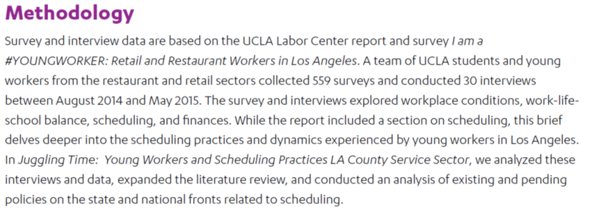

```{r setup, include=FALSE}
knitr::opts_chunk$set(echo = TRUE)
```

# Describing datasets


## How was the data produced? {.unnumbered}

Some common types of observational data:

* **Survey data:** survey responses from a sample of individuals
* **Administrative data:** administrative records from a gov't agency or organization


## Cross-sectional vs panel data {.unnumbered}

A **cross-section** of data is just a set of observations for one period of time. For example, a set of evaluations from students for a particular course in a given semester. You can imagine a second cross-section of data: a second set of evaluations from a different set of students for the same course but in a different semester. 

Cross-sections of data can be combined into a single dataset, but that is different from **panel data** where the *same individuals* or entities are observed in each period.


## Unit of observation and representative population {.unnumbered}

It might seem obvious if you're working with familiar data, but in many cases it may not be immediately obvious: what is the unit of observation in the dataset you're working with, and what population are observations drawn from? 

Many large government surveys are based on a sample drawn at random from some broader population (e.g. a sample of working adults). Survey data requires you to apply **sampling weights** in order to obtain a representative population. This is because the likelihood of a subject responding to a survey is not random, but in fact depends on other variables such as age, gender, education, etc. 

Sampling weights serve to re-weight the data so people who were more likely to respond count less (and people who were less likely to respond count more). For survey data, you typically must use weights or else the sample won’t be representative of the true population of interest in terms of age, race, gender, etc.

***Discussion question:*** *Which respondents are more likely to respond to a telephone survey?*
<br/><br/>
 
For administrative data, each observation typically represents 1 record (e.g. a single case or program participant) and the data often includes the entire "population" of cases. Administrative data is rarely collected and managed with outside analysis in mind, so the documentation may be quite limited. All the more important to conduct exploratory data analysis to make sense of the data and identify inconsistencies or other issues.


# Application: comparing two datasets on unpredictable scheduling

**Unpredictable scheduling** refers to the practice of employers assigning shifts to their workers with short notice and irregular hours. Many low-wage employers are effectively forced to be on-call to pick up shifts on short notice, with an unpredictable stream of income to pay bills, and often left scrambling for child care.

## Dataset 1: The Unheard Third Survey {.unnumbered}

{width=75%}
<br/><br/>
***Discussion questions:***

* *Cross-sectional or panel data?*
* *Unit of observation?*
* *Is it a random sample? What population is represented by the sample?*
* *Why do you think low-income NYers are over-sampled?*
* *Why is it necessary to use sampling weights when analyzing the data?*
* *Any concerns about how the data was generated (sampling scheme)?*


## Dataset 2: UCLA Young Workers Study {.unnumbered}

{width=75%}
<br/><br/>
***Discussion questions:***

When it comes to analyzing the impact and prevalence of unpredictable scheduling:

- *What are some advantages of the UHT with respect to the UCLA study?*
- *What are some disadvantages?*


